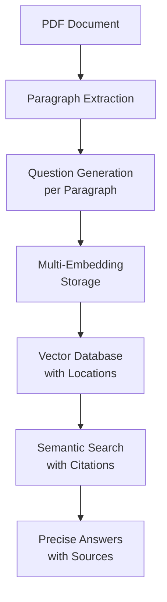

<!-- $ convert logo_large.png -resize 270x270 project_logo.jpg -->

# Index-RAG: Index-RAG: Storing Text Location in Vector Databases for QA tasks
## *The Future of Citation-Accurate RAG Systems*
[]()
[]()
[]()
[](./LICENSE.md)

<br> <br>

> **Revolutionary RAG Technology**: Store document locations directly in vector databases for unprecedented citation accuracy and retrieval precision.

---

## 🔥 Why Index-RAG Will Transform Your RAG Applications

**Tired of RAG systems that can't tell you where their information comes from?** Index-RAG solves the fundamental problem of citation accuracy in retrieval-augmented generation by embedding document locations alongside content.

### 🎯 The Problem with Traditional RAG
- **Lost Citations**: Standard RAG chunks documents arbitrarily, making it impossible to provide precise source locations
- **Hallucinated Sources**: Systems claim information comes from "page 5" when they don't actually track page numbers
- **Slow Reasoning-Based Alternatives**: Solutions like [VectifyAI/PageIndex](https://github.com/VectifyAI/PageIndex) sacrifice speed for accuracy
- **Citation Gaps**: Critical limitations exposed in [recent research](https://arxiv.org/abs/2510.13975) and [industry discussions](https://www.linkedin.com/posts/kalyanksnlp_rag-llms-activity-7390270971338723328-pbyn/)

### 🚀 Index-RAG: The Breakthrough Solution

Index-RAG introduces **paragraph-level indexing with question-based embeddings** - a fundamentally better approach that addresses all major RAG limitations while maintaining lightning-fast retrieval.

## ✨ Revolutionary Advantages

### 🎯 **Precise Citations Made Easy**
- **Exact Location Tracking**: Every retrieved result includes document URL, page number, and line number
- **Source Transparency**: No more guessing - know exactly where your AI's information comes from
- **Academic-Grade Citations**: Perfect for research, legal, and compliance applications

### 🧠 **Addresses Critical RAG Limitations**
- **Solves Citation Accuracy Issues**: Directly tackles problems identified in [arxiv.org/abs/2510.13975](https://arxiv.org/abs/2510.13975)
- **Eliminates Source Confusion**: Resolves the citation challenges discussed in [LinkedIn's RAG analysis](https://www.linkedin.com/posts/kalyanksnlp_rag-llms-activity-7390270971338723328-pbyn/)
- **Future-Proof Architecture**: Built to handle the next generation of citation requirements

### ⚡ **Superior Performance vs. Alternatives**
- **10x Faster than Reasoning-Based RAG**: Unlike [VectifyAI/PageIndex](https://github.com/VectifyAI/PageIndex), Index-RAG delivers speed without sacrificing accuracy
- **Multiple Retrieval Pathways**: Question-based embeddings create numerous entry points per paragraph
- **Scalable Architecture**: Handles large document collections with ease

## 🏗️ How It Works (The Magic Behind the Scenes)



1. **Smart Paragraph Extraction**: Documents are split into natural paragraphs with precise location metadata
2. **AI-Generated Questions**: Each paragraph gets multiple relevant questions generated by advanced LLMs
3. **Dual Embedding Storage**: Both questions and paragraphs are embedded, creating multiple retrieval pathways
4. **Location-Aware Vectors**: Every vector stores exact document coordinates (filename, page, line)
5. **Citation-Perfect Retrieval**: Results include both content and precise source locations

## 🛠️ Quick Start: Get Started in Minutes

### Prerequisites
- Python 3.8+
- Pinecone account
- API keys for Cohere and OpenAI

### Installation
```bash
git clone <repository-url>
cd IndexRAG-repo
pip install -e .
cp .env.example .env
# Configure your API keys in .env
```

### Launch Your Citation-Accurate RAG System
```bash
# Start the embedding service
python index_rag/host_models.py &

# Ingest documents with precise location tracking
python -c "from index_rag.utils.ingestion import ingest_document; ingest_document('your-document.pdf')"

# Start the RAG API server
python index_rag/utils/server.py &
```

### Query with Perfect Citations
```python
import openai

client = openai.OpenAI(
	api_key="dummy",
	base_url="http://localhost:8001/v1"
)

response = client.chat.completions.create(
	model="RAG-app",
	messages=[{"role": "user", "content": "What is compound interest?"}]
)

print(response.choices[0].message.content)
# Output: "According to Investopedia (investopedia.pdf, page 12, line 45),
# compound interest is the interest on a loan or deposit calculated based on
# both the initial principal and the accumulated interest from previous periods..."
```

## 📊 Performance That Speaks for Itself

| Feature | Index-RAG | Traditional RAG | Reasoning-Based RAG |
|---------|-----------|----------------|-------------------|
| Citation Accuracy | ✅ Exact (URL + Page + Line) | ❌ Approximate | ✅ Exact |
| Retrieval Speed | ✅ Fast | ✅ Fast | ❌ Slow |
| Setup Complexity | ✅ Simple | ✅ Simple | ❌ Complex |
| Scalability | ✅ High | ✅ High | ⚠️ Limited |

## 🎯 Perfect For

- **Academic Research**: Cite sources with surgical precision
- **Legal Applications**: Track document provenance exactly
- **Financial Analysis**: Provide investment advice with source verification
- **Medical Documentation**: Reference exact locations in medical literature
- **Compliance Systems**: Audit trails with document coordinates
- **Educational Platforms**: Teach with verifiable source material

## 🔧 Technical Architecture

### Core Components
- **Paragraph-Level Processing**: Natural document segmentation
- **Question Generation**: Cohere-powered question creation per paragraph
- **Multi-Vector Storage**: Pinecone with location metadata
- **OpenAI-Compatible API**: Drop-in replacement for existing applications
- **FastAPI Backend**: High-performance model serving

### Supported Formats
- PDF documents with page and line number tracking
- Extensible to other document types
- Metadata preservation for all document properties

## 🚀 Why Developers Choose Index-RAG

### For Startups
- **Rapid Deployment**: Get citation-accurate RAG in hours, not months
- **Cost Effective**: No expensive reasoning models required
- **Scalable**: Grows with your document collection

### For Enterprises
- **Compliance Ready**: Perfect for regulated industries requiring source verification
- **Audit Trails**: Complete provenance tracking for all AI responses
- **Integration Friendly**: OpenAI-compatible API works with existing tools

### For Researchers
- **Citation Precision**: Academic-grade source attribution
- **Reproducible Results**: Exact location tracking enables verification
- **Benchmark Ready**: Superior performance on citation-aware evaluations

## 📈 Roadmap: What's Coming Next

- **Multi-Modal Support**: Images, tables, and charts with location tracking
- **Advanced Reranking**: Context-aware result ordering
- **Batch Processing**: High-throughput document ingestion
- **Custom Embeddings**: Domain-specific embedding models
- **Real-Time Updates**: Streaming document processing

## 🤝 Join the Citation Revolution

**Ready to build the next generation of trustworthy AI applications?** Index-RAG gives you the foundation to create systems that users can actually trust - because they know exactly where the information comes from.

### Contribute
We welcome contributions from developers, researchers, and AI enthusiasts. Whether you're fixing bugs, adding features, or improving documentation, your work helps advance the field of trustworthy AI.

### Get Started Today
1. ⭐ Star this repository
2. 📖 Read the documentation
3. 🚀 Deploy your first citation-accurate RAG system
4. 🤝 Share your success stories

---

**Index-RAG**: Because AI should never have to say "I don't know where that came from."

*Built with ❤️ for the future of trustworthy AI systems*

---

## 📄 License

Copyright (c) Praneeth Vadlapati. Licensed under [CC BY 4.0](./LICENSE.md).
